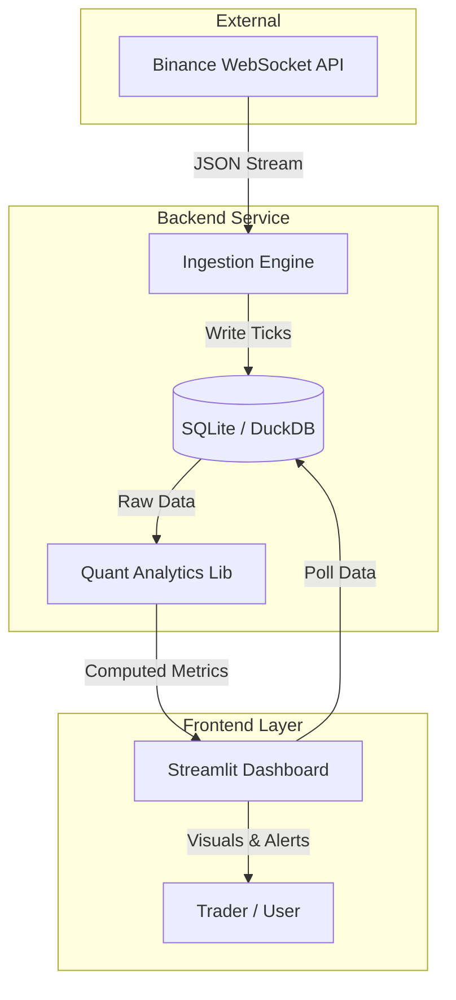

# ⚡ Gemscap: Real-Time Quantitative Analytics Platform


A high-frequency quantitative analytics dashboard designed for statistical arbitrage and market microstructure analysis. **Gemscap** ingests live crypto assets tick data, computes complex statistical metrics in real-time, and visualizes trading signals with sub-second latency.

---

## 🚀 Key Features

### 📡 Real-Time Data Engineering
- **WebSocket Ingestion**: Direct low-latency connection to Binance Market Streams (`!ticker@arr` / `trade` streams).
- **Asynchronous Pipeline**: Decoupled ingestion thread ensuring 100% data capture rate without blocking the UI.
- **Micro-Storage**: Optimized SQLite schema for persisting high-velocity tick data.

### 🧠 Quantitative Engine
The core analytics module (`src/analytics.py`) implements sophisticated financial models:

- **Pairs Trading (Statistical Arbitrage)**:
  - Dynamic Hedge Ratio ($\beta$) via **Ordinary Least Squares (OLS)** regression.
  - Formula: $Spread_t = Y_t - \beta \cdot X_t$
- **Mean Reversion Signal**:
  - Rolling **Z-Score** normalization with configurable lookback windows.
  - Formula: $Z_t = \frac{Spread_t - \mu}{\sigma}$
- **Stationarity Testing**:
  - Real-time **Augmented Dickey-Fuller (ADF)** test to validate the mean-reverting property of the spread.
- **Dynamic Correlation**:
  - Rolling Pearson correlation coefficient to monitor decoupling events.

### 📊 Interactive Dashboard
- **Live Visualization**: Auto-refreshing Plotly charts for Price, Spread, Z-Score, and Correlation.
- **Signal Alerting**: Visual alarms when $|Z_{score}| > Threshold$ (default $2.0\sigma$).
- **Customizable Parameters**: Adjust timeframes (1s, 1m, 5m), rolling windows, and assets on the fly.

---

## 🏗️ System Architecture

The application follows a modular Event-Driven Architecture:



---

## 🛠️ Installation & Setup

### Prerequisites
- Python 3.8+
- Git

### Quick Start

1.  **Clone the Repository**
    ```bash
    git clone https://github.com/sahilkapase/gemscap.git
    cd gemscap
    ```

2.  **Install Dependencies**
    ```bash
    pip install -r requirements.txt
    ```

3.  **Launch the Platform**
    ```bash
    python main.py
    ```
    > This command orchestrates both the background ingestion service and the frontend dashboard. The app will open automatically at `http://localhost:8501`.

---

## 📂 Repository Structure

```
gemscap/
├── src/
│   ├── ingestion.py       # Async WebSocket Client
│   ├── storage.py         # Thread-safe Database Layer (SQLAlchemy)
│   ├── analytics.py       # Financial Modeling & Statistics
│   ├── dashboard.py       # Streamlit UI & Visualization Logic
│   └── config.py          # Global Configuration (Symbols, API URLs)
├── main.py                # Service Orchestrator (Entry Point)
├── check_status.py        # System Diagnostic Utility
├── requirements.txt       # Dependency Manifest
└── README.md              # Documentation
```

## 🧪 Verification

To ensure the system is operating correctly:
1.  Run the diagnostic script: `python check_status.py`
2.  Check for **Active Ingestion** logs (Latency should be < 1s).
3.  Open the Dashboard and verify charts are populating.

---

## 🤝 Contributing

Contributions are welcome! Please format code using `black` and ensure all analytics functions have type hints.

## 📄 License

MIT License. See `LICENSE` for details.
